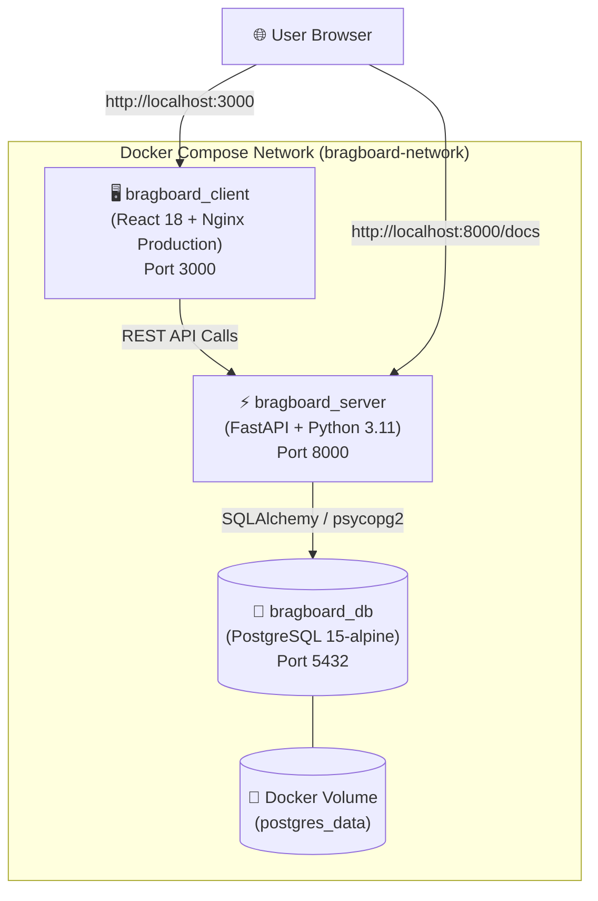

# 🐳 BragBoard - Docker Deployment & Operations Guide

A production-grade, multi-container architecture for **BragBoard**, orchestrating the React frontend (with Nginx), FastAPI backend, and PostgreSQL database.

---

## 🏗️ Architecture Overview



### Container Services

| Service | Container Name | Image / Base | Internal Port | Host Port | Purpose |
| :--- | :--- | :--- | :--- | :--- | :--- |
| **Frontend** | `bragboard_client` | `node:18-alpine` ➔ `nginx:alpine` | 80 | **3000** | Production React build served with Nginx (gzip, client caching, SPA routing). |
| **Backend** | `bragboard_server` | `python:3.11-slim` | 8000 | **8000** | High-performance FastAPI ASGI REST service with JWT auth & CORS. |
| **Database** | `bragboard_db` | `postgres:15-alpine` | 5432 | **5432** | Persistent PostgreSQL with health check probe & volume backup. |

---

## 🚀 Quickstart: Running the Stack

Make sure **[Docker Desktop](https://www.docker.com/products/docker-desktop/)** is installed and running.

### 1. Start All Services (With Build)
```bash
docker compose up --build -d
```
> **Note**: `-d` runs the containers in the background (detached mode).

### 2. Verify Container Health
```bash
docker compose ps
```
You should see all three containers (`bragboard_client`, `bragboard_server`, `bragboard_db`) in an **Up** status.

---


## 🌐 Application Endpoints

- **Web Application**: [http://localhost:3000](http://localhost:3000)
- **FastAPI Interactive API Docs (Swagger UI)**: [http://localhost:8000/docs](http://localhost:8000/docs)
- **FastAPI Alternative Docs (ReDoc)**: [http://localhost:8000/redoc](http://localhost:8000/redoc)
- **Backend Health Check**: [http://localhost:8000/analytics/overview](http://localhost:8000/analytics/overview)

---

## 🛠️ Operational Commands Cheat Sheet

### Lifecycle Commands
```bash
# Start all containers in background
docker compose up -d

# Rebuild and start after code updates
docker compose up --build -d

# Stop containers without losing database data
docker compose stop

# Restart services
docker compose restart

# Stop and remove containers and networks
docker compose down

# Stop, remove containers, AND wipe the PostgreSQL database volume (Fresh Reset)
docker compose down -v
```

### Logs & Diagnostics
```bash
# Stream live logs for all containers
docker compose logs -f

# Backend FastAPI logs only
docker compose logs -f server

# Frontend Nginx logs only
docker compose logs -f client

# PostgreSQL logs only
docker compose logs -f db
```

### Running Commands Inside Containers
```bash
# Execute bash shell in the backend container
docker compose exec server bash

# Re-run or refresh the database seed data
docker compose exec server python seed_data.py

# Access the PostgreSQL CLI directly
docker compose exec db psql -U bragboard_user -d bragboard_db
```

---

## 🔒 Security & Data Persistence

1. **Persistent Volume**: PostgreSQL data is mapped to the named Docker volume `postgres_data`. When you restart or rebuild containers, your users, shoutouts, and reports remain intact.
2. **Password Security**: All user passwords are encrypted with one-way **bcrypt** hashing before reaching the database. Plain passwords are never stored.
3. **Stateless JWT Tokens**: Authentication uses HS256-signed JSON Web Tokens passed in `Authorization: Bearer <token>` headers.
4. **Isolated Docker Network**: Services communicate through an isolated internal bridge network (`bragboard-network`).

---

## ☁️ Cloud Deployment Guidelines

This configuration is container-portable and ready for zero-downtime deployment on cloud providers:

- **Render / Railway**: Link your GitHub repository, choose **Docker Compose** or single Dockerfile deploys.
- **AWS ECS / GCP Cloud Run**: Build and push Docker images to Amazon ECR or Google Artifact Registry.
- **Self-Hosted VPS (DigitalOcean / Linode / EC2)**:
  1. Clone this repository onto your server.
  2. Run `docker compose up --build -d`.
  3. Point your domain (A-record) to the VPS IP address.
